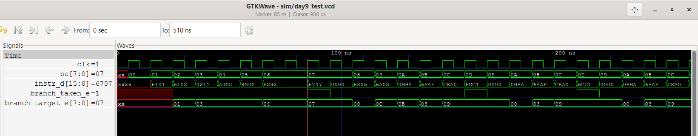
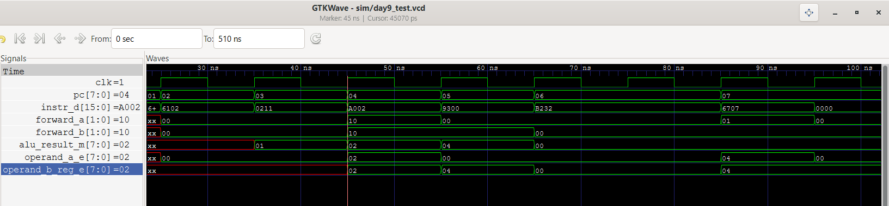

# 8-bit 5-Stage Pipelined Processor

A custom 8-bit RISC-style processor with a classic 5-stage pipeline (IF-ID-EX-MEM-WB), implemented in Verilog. Harvard architecture, 16-bit instruction word, 16 general-purpose 8-bit registers.

## Architecture

- 13-instruction subset: `ADD`, `SUB`, `AND`, `OR`, `XOR`, `SLT`, `ADDI`, `ANDI`, `ORI`, `LW`, `SW`, `BEQ`, `BNE`
- Custom instruction encoding (flat 4-bit opcode, no funct field — a deliberate trade-off given the 16-bit word width)
- Data hazards resolved via a dedicated forwarding unit (EX/MEM and MEM/WB paths) plus a register-file-internal bypass for same-cycle write/read collisions
- Load-use hazard resolved via pipeline stalling with hazard detection
- Control hazards (taken branches) resolved via a two-register flush (IF/ID and ID/EX) and PC redirect, resolved in EX

## Verified (self-checking testbenches, Icarus Verilog)

- Single-cycle datapath (correctness baseline before pipelining)
- Full pipeline, no-hazard integration test
- Forwarding, at 1- and 2-instruction dependency distance, with correct MEM-over-WB priority
- Register-file same-cycle write/read bypass (3+ instruction distance)
- Load-use hazard: stall then forward
- Store-data forwarding (SW operand forwarded, not just the address)
- Taken and not-taken branches, including a branch immediately after a load
- Backward branch (loop), confirming negative sign-extended offsets
- Wrong-path instruction flush after a taken branch (both squash points checked)
- Writes to r0 are discarded

## Waveforms

**Load-use stall** — one bubble cycle inserted before the dependent instruction proceeds:

**Branch flush** — wrong-path instruction squashed after a taken branch:

**Backward branch (loop)** — PC redirects backward three times, then falls through on exit:

**Forwarding** — EX/MEM forwarding mux selects the producer's result one cycle after it's computed:

## Tools

Icarus Verilog + GTKWave for simulation and waveform debugging.

## Structure
